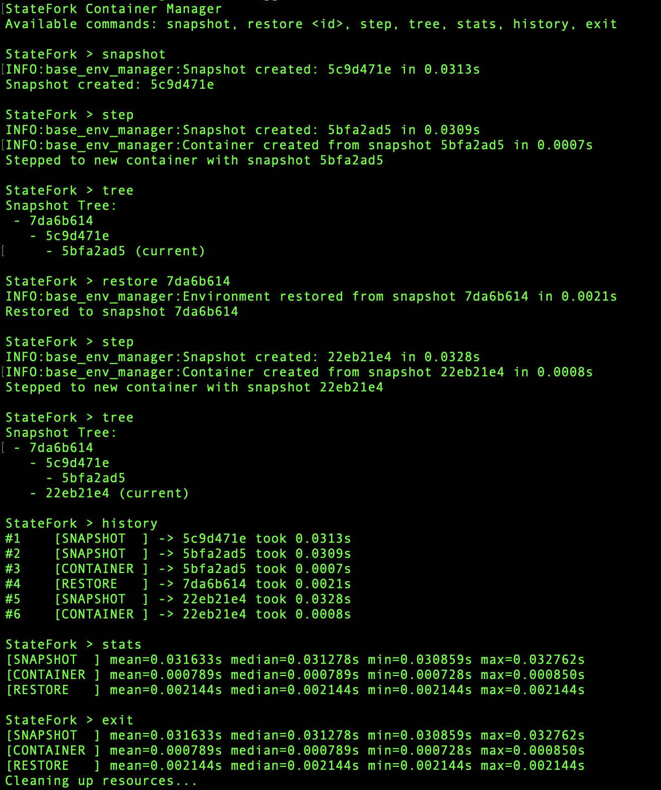

# StateFork: A Lightweight Versioned Container Manager

**StateFork** is a simple container-based snapshotting and benchmarking tool designed to manage runtime environments in a version-controlled manner. It allows you to take snapshots of running containers, restore to previous versions, and benchmark key operations — all without modifying the target application.

## 🌟 Features

- 🌱 Create container snapshots from a running app
- 🔁 Restore any previous snapshot and relaunch the container
- 🧪 Measure and log performance of snapshot, restore, and switch operations
- 📦 Designed for unmodified applications (e.g. FastAPI, Shell, etc.)
- 🔧 CLI-based interface for interactive experiment control

## 🗂 Project Structure
```
StateFork/
  ├── Dockerfile
  ├── README.md
  ├── app
  │   ├── api_server.py (example app 1)
  │   ├── kv_store.py (example app 1)
  |   └── stateful_logger.py (example app 2)
  ├── controller
  │   ├── base_env_manager.py
  │   ├── benchmark.py
  │   ├── criu_env_manager.py
  │   ├── docker_env_manager.py
  │   └── main.py
  └── requirements.txt
```

## 🚀 Quick Start

### 1. Prepare the Base App

Ensure your application (e.g., `app/api_server.py`) is working and can run via:

```bash
uvicorn app.api_server:app --host 127.0.0.1 --port 8000
```

### 2. Run the Container Manager
```bash
python3 controller/main.py --method docker
```
You will enter an interactive shell like:
```
StateFork Container Manager
Commands: snapshot, restore <id>, . . . , exit
StateFork > _
```
See the sample run screenshot below.

### 3. Common Commands
| Command	      | Description                                        |
|---------------|----------------------------------------------------|
| snapshot	     | Commit current container as a new image (snapshot) |
| restore {id}	 | Restore to a previous snapshot (by snapshot ID)    |
| step	         | Take a snapshot and create a new container from it |
| tree	         | Draw the tree graph of snapshot IDs                |
| stats	        | Show timing benchmark for operations               |
| history	      | List all operation logs                            |
| exit	         | Clean up and exit the manager                      |

## 🔧 Requirements
- Python 3.10+
- Your app's dependencies, such as FastAPI and Uvicorn (see `requirements.txt`)

### Docker Method
- Docker is installed and running.

### CRIU Method
- A Linux kernel compiled with CRIU support.
    - You may use my universal AKCS helper `scripts/kconfig.sh` with the `-r` option to generate a compatible kernel config.
- `criu` tool installed from https://launchpad.net/~criu/+archive/ubuntu/ppa or your system package manager.

## 📊 Benchmarking Support
The tool logs and displays operation performance statistics such as:
- Snapshot creation time
- Container restore time
- Sequential operation logging with timestamps

## 📸 Sample Run

