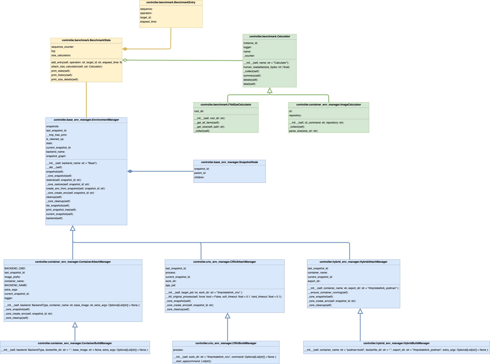

# StateFork: A Lightweight Versioned Container Manager

**StateFork** is a simple, modular snapshotting and benchmarking tool for managing long-running applications in a 
version-controlled and reproducible environment. It supports both container-based (Docker, Podman) and process-based (CRIU) backends, 
enabling users to take snapshots, roll back state, and benchmark key operations across different platforms.

## 🌟 Features

- 🌱 Take and manage snapshots of running apps
- 🔁 Restore to previous snapshots instantly
- 🧪 Benchmark time and storage performance of snapshot/restore operations
- 🧩 Works with unmodified apps (FastAPI, Python/C++ scripts, etc.)
- ⚙️ CLI-based interactive interface
- 🧱 Easily extendable backend design with Docker, Podman, CRIU, or FirecrackerVM support

## 🗂 Project Structure
```
StateFork/
  ├── Dockerfile
  ├── README.md
  ├── app/                    # Sample applications
  │   ├── stateful_logger.py
  │   ├── api_server.py
  │   └── ...
  ├── controller/            # Core controller package
  │   ├── __init__.py
  │   ├── README.md
  │   ├── base_env_manager.py
  │   ├── benchmark.py
  │   ├── criu_env_manager.py
  │   ├── container_env_manager.py
  │   ├── hybrid_env_manager.py
  │   └── ...
  ├── interface/             # Interface entrypoints
  │   ├── README.md
  │   └── shell.py
  ├── logs/                  # Benchmark and package analysis files
  ├── scripts/               # Testing and utility scripts
  └── requirements.txt
```

## 🔧 Environment Manager Variants
StateFork provides multiple environment manager variants, each tailored to different backend technologies and lifecycle scenarios.

They follow the naming convention `{Backend}{Action}Manager`, where:
- **{Backend}** Backend type:
  - `Container` for Docker/Podman (manages file system state only)
  - `CRIU` for process-level CRIU checkpointing
  - `Hybrid` for Podman + CRIU (captures both file and process states) 
- **{Action}** Lifecycle mode:
  - `Build` starts a fresh instance (for testing/dev)
  - `Attach` connects to an existing container or process

### 🏭 Factory Method Support
StateFork encourages a clean and extensible design by providing
a unified **Factory Method** to simplify the instantiation of different environment managers. 

Instead of importing backend-specific classes, users can create the appropriate manager by calling a single 
`create_env_manager(method=..., **kwargs)` function. This design improves usability, 
decouples interface logic from implementation, and enables easier CLI/RPC/agent integration.

Simply specify the desired environment type (e.g., `"criu_attach"`, `"docker_build"`) along with the required parameters, and the 
factory will handle the rest.
```python
from controller import create_env_manager
manager = create_env_manager(method="criu_attach", target_pid=12345)
```
See the full method table below for supported types and arguments.

| Factory Call Name | Env Manager            | Backend       | Required Arguments                       | Optional Arguments                                                                       |
|-------------------|------------------------|---------------|------------------------------------------|------------------------------------------------------------------------------------------|
| `docker_build`    | ContainerBuildManager  | Docker        |                                          | `dockerfile_dir(str)`, `base_image(str)`, `extra_args(List[str])`                        |
| `docker_attach`   | ContainerAttachManager | Docker        | `container_name(str)`, `base_image(str)` | `extra_args(List[str])`                                                                  |
| `podman_build`    | ContainerBuildManager  | Podman        |                                          | `dockerfile_dir(str)`, `base_image(str)`, `extra_args(List[str])`                        |
| `podman_attach`   | ContainerAttachManager | Podman        | `container_name(str)`, `base_image(str)` | `extra_args(List[str])`                                                                  |
| `criu_build`      | CRIUBuildManager       | CRIU          |                                          | `work_dir(str)`, `command(List[str])`                                                    |
| `criu_attach`     | CRIUAttachManager      | CRIU          | `target_pid(int)`                        | `work_dir(str)`                                                                          |
| `hybrid_build`    | HybridBuildManager     | Podman + CRIU |                                          | `container_name(str)`, `dockerfile_dir(str)`, `export_dir(str)`, `extra_args(List[str])` |
| `hybrid_attach`   | HybridAttachManager    | Podman + CRIU | `container_name(str)`                    | `export_dir(str)`                                                                        |

## 🧪 Benchmarking Support
StateFork automatically logs and benchmarks the performance of:

- Snapshot creation
- Restore operations
- Tree-based version tracking
- Time-based operation history
- Storage usage

## ⚙️ Core Controller Design


## 🔧 Requirements
### Python Environment
- Python 3.10+
- Install Python dependencies:
```bash
pip install -r requirements.txt
```

### Docker Method
- Docker must be installed and running.
- Make sure your user has permission to run Docker commands.

### Podman Method
- Podman must be installed and running.
- Make sure your user has permission to run Podman commands.

### CRIU Method
- Linux kernel compiled with CRIU support.
    - You may use the provided universal AKCS helper `scripts/kconfig.sh` with the `-r` option to generate a compatible kernel config.
- Install `criu` tool from: https://launchpad.net/~criu/+archive/ubuntu/ppa or your system package manager.
- Root or `sudo` privileges are required.

### Hybrid Method (Podman + CRIU)
- CRIU and Podman must be installed as above.
- Must use Root or `sudo` privileges to run Podman commands, as [the checkpoints currently work with root containers only](https://podman.io/docs/checkpoint).
- Manually set the OCI runtime in `/usr/share/containers/containers.conf` to use **runc** instead of the default **crun**.

---
For core controller usage, see the `controller/README.md` file.  
For interface usage, see the `interface/README.md` file.

> Want to contribute? File issues or PRs in the GitHub repo!
